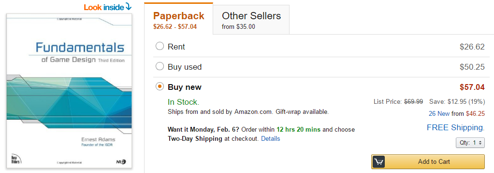
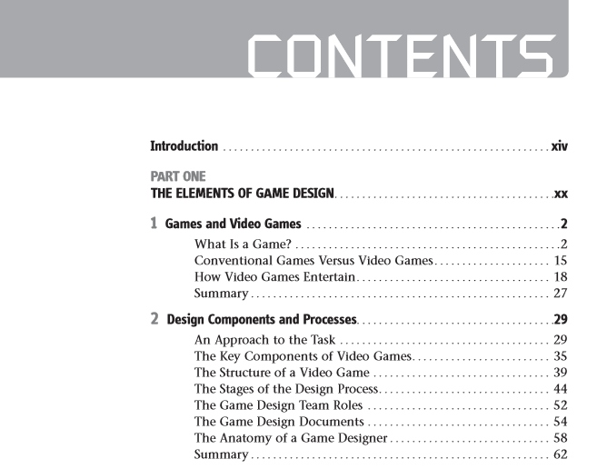

# Game-Mechanics
《游戏机制》读书笔记

在公司图书角随手抽的一本书。扫完觉得有趣就拿走了。

对解决我当前遇到的工作上的问题（数值啊数值）没有帮助，但对游戏设计者（如果想做独立游戏研发者，强烈推荐此书）非常有帮助，可以从科学的角度解析游戏中机制的构成方法及特性。
本着“系统数值不分家”的理念，抱着树立自己游戏观的想法，细读前四章的理论部分并作了此笔记。
第五章之后引入Machinations工具，并基于该模型详细讲解了几款游戏的设计机制。未通读。

此书之前还有一本《Fundamentals of Game Design》，是更基础版本的入门书，并未引进。

不过意外找到了pdf版，悲喜交加。

先存档。

